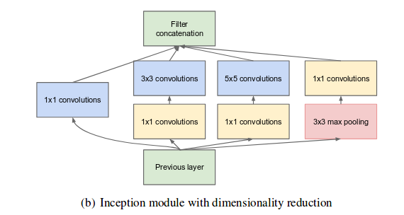

# Resnets

* **Full Title**: [Going Deeper with Convolutions](https://www.cs.unc.edu/~wliu/papers/GoogLeNet.pdf)
* **Authors**: Christian Szegedy, Wei Liu, Yangqing Jia, Pierre Sermanet, Scott Reed, Dragomir Anguelov, Dumitru Erhan, Vincent Vanhoucke, Andrew Rabinovich
* **Publication/Year**: CVPR- 2015

## Main Contributions-
1. The design follows the practical intuition that visual information should be processed at various scales and then aggregated so that the next stage can abstract features from the different scales simultaneously.
2. Judiciously reducing dimension wherever the computational requirements would increase too much otherwise- 
  

3.  By adding auxiliary classifiers (at train time only!) connected to intermediate layers, discrimination in the lower stages in the classifier was expected to step up gradient flow for middle - level layers. This was thought  to  combat  the  vanishing  gradient  problem  while providing  regularization.
4. Softmax probabilities are averaged over 7 diifferent networks (the ensemble long-cut!).
5. Propose a new method of generating 144 samples from one image and emperically show that it performs better than all the previous data augmentation tricks.