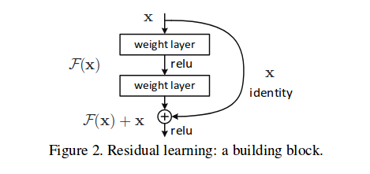

# Resnets

* **Full Title**: [Deep Residual Learning for Image Recognition](https://arxiv.org/abs/1512.03385)
* **Authors**: Kaiming He, Xiangyu Zhang, Shaoqing Ren and Jian Sun
* **Publication/Year**: CVPR- 2016

## Main Contributions-
1. Observed that stacking of more layers in plain networks does not mean more accuracy (Lesser accuracy not necessarily due to overfitting!).
2. Introduced residual skip connections, which look as follows- 
  

3.  Identity shortcuts are always used, except for the cases when there is a change in resolution, projection matrices are used (proven by experiments that projections result in only marginal improvements for a huge compute).
4.  Even with deeper Bottleneck architectures (increased depth but reduced compute with 1x1 layers), the overall size remains less than the classic VGGs.

## Detailed reading suggestions-
[This blog](https://towardsdatascience.com/an-overview-of-resnet-and-its-variants-5281e2f56035) provides details of resnet nad related architectures like Densenet.