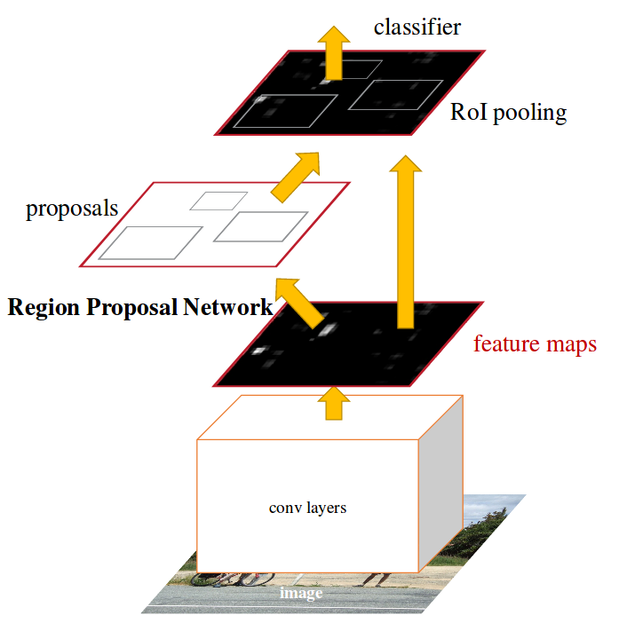

# Mask-RCNN

* **Full Title**: [Mask R-CNN](https://arxiv.org/pdf/1703.06870.pdf)
* **Authors**: Kaiming He, Georgia Gkioxari, Piotr Dollar, Ross Girshick
* **Publication/Year**: ICCV - 2017

## Main Contributions-
### [Faster R-CNN](https://arxiv.org/pdf/1506.01497.pdf)
* A multi-step approach to object detection. Feature extraction with pre-trained image recognition networks; Region Proposal Network on feature-map; ROI pooling; Joint training for classification and bounding-box regression.
* A weighted combination of four losses is used for final joint training for the full network.
* **Region Proposal Network**- Intermediate multi-resolution learning for anchor-boxes of different sizes; Learn two parameters- whether or not a region is object and what are the tight bounds for these regions. At training time, these regions are sampled in a way such that there is a distribution of 1:1 in positive and negative regions. A glimpse of RPNs can be seen in the image below.  
  

* **ROI Pooling layer**- When multiple anchor boxes at different resolutions are suggested by the RPN above as regions of interests, they are projected to form a feature map of consistent resolution, for smooth functioning of the following classification and regression layers.

### Mask R-CNN
* First end-to-end network to perform all the possible object detection tasks- Bounding Box regression, classification, instance-level segmentation.
*  Main 2 contributions are- ROI Align layer and Instance level binary segmentation inside a bounding box.
* **ROI Align**- Instead of hard quantization while resizing in ROI pool, ROI Align uses soft biliniear interpolation. This boosts the accuracy of pixel-level segmentation by a significant relative amount.
* This network has also suggested step-wise training for 

## Detailed reading suggestions-
* [This blog](https://medium.com/@jonathan_hui/image-segmentation-with-mask-r-cnn-ebe6d793272) explains ROI Align layer nicely.
* These blogs by- [Athelas](https://blog.athelas.com/a-brief-history-of-cnns-in-image-segmentation-from-r-cnn-to-mask-r-cnn-34ea83205de4) and [Neuromation](https://medium.com/neuromation-io-blog/neuronuggets-segmentation-with-mask-r-cnn-c76d363b67fb) give a good intuition about all the logical steps in development of the mega algorithm from R-CNN to Mask R-CNN.